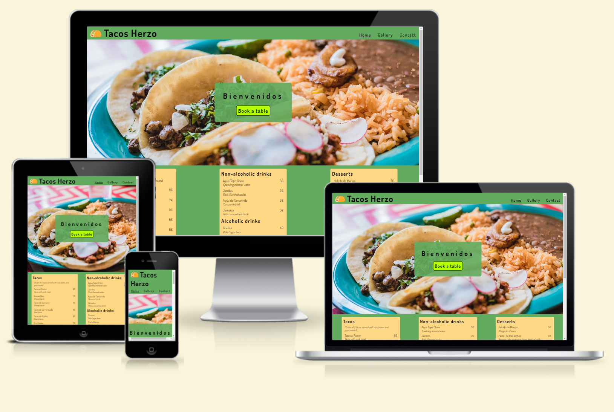
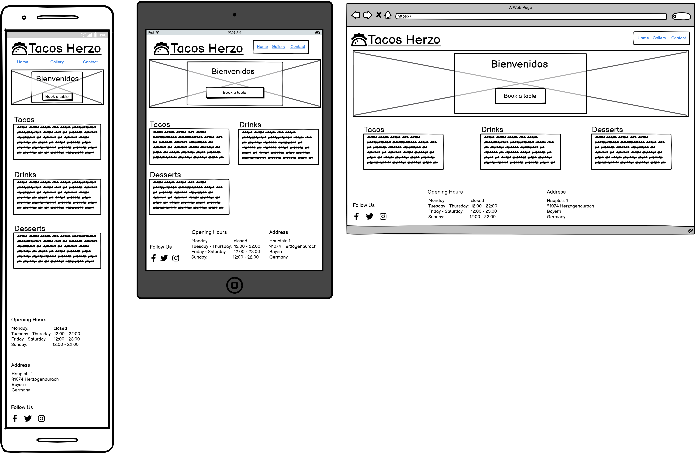
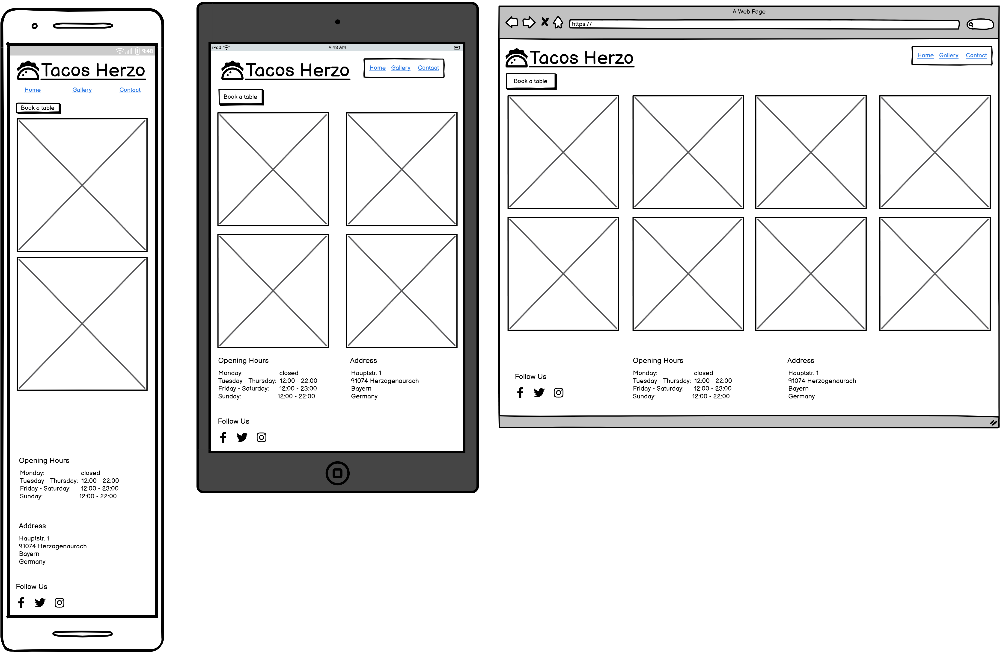
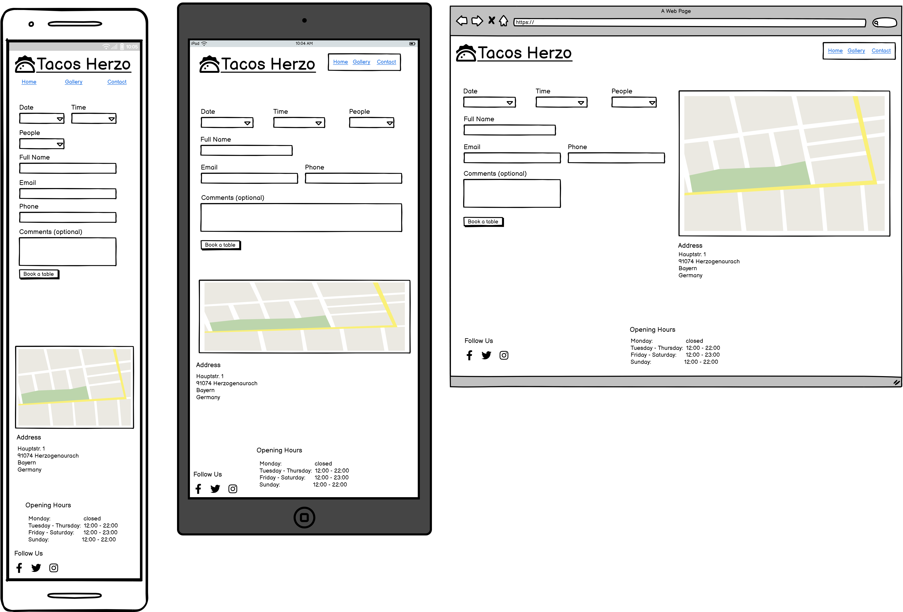
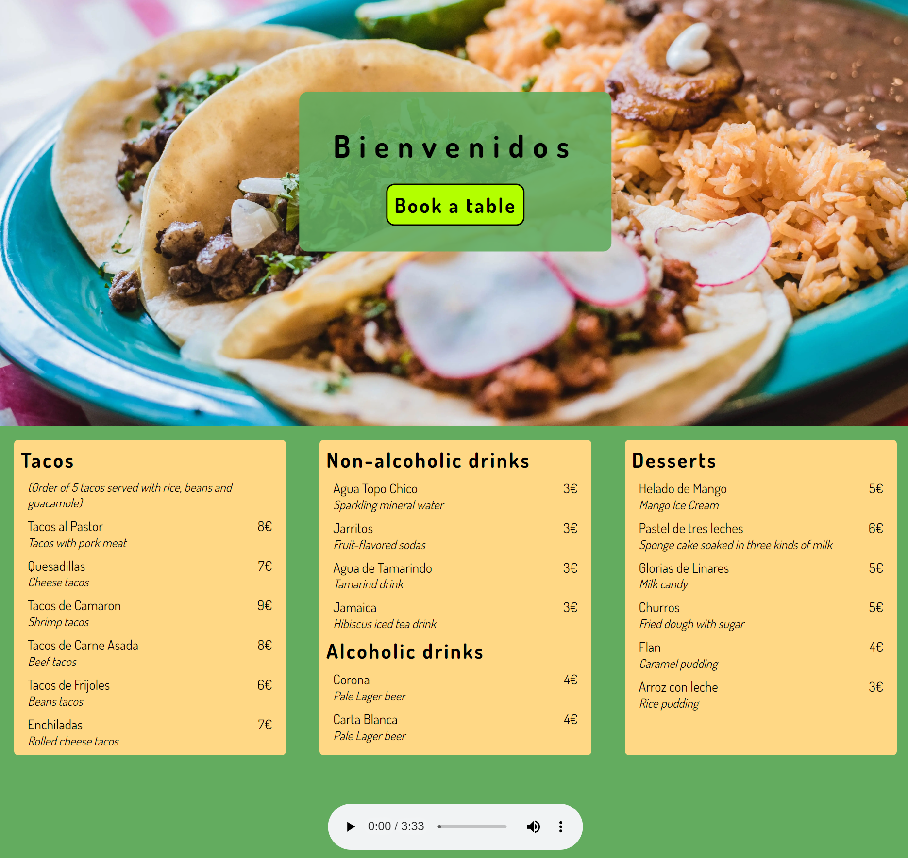
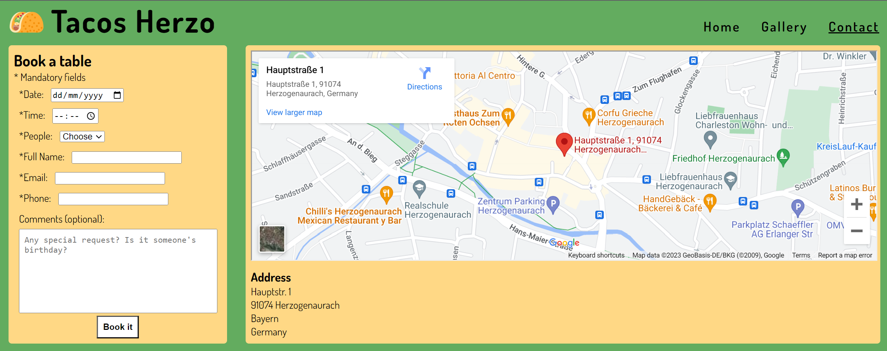
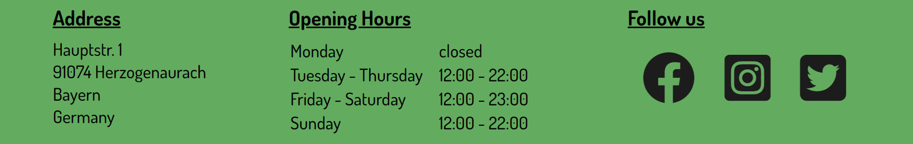

# Tacos Herzo
Tacos Herzo is a website for an imaginary Mexican food restaurant in the heart of Herzogenaurach (Herzo as it's called) in Bayern, Germany. The website is intended for anyone who is interested in trying out Mexican food in Herzo as well for returning customers.

The main purpose of the Tacos Herzo is to increase the number of table reservations for its restaurant.
This is achieved by clearly presenting the dishes and drinks we serve in our Menu which is shown directly in the Homepage. As some people would like to see how our dishes are served, Tacos Herzo also shows pictures of the dishes in a gallery page.

## Design

- __Wireframes__
    - Wireframes were generated using Balsamiq for Mobile, Tablets and Larger screens.
    
    Homepage
    

    Gallery
    
    
    Contact
    

- __Colors__
    - The colors used for Tacos Herzo were inspired by the colors of some of the ingredients used in mexican dishes such as Lime, Avocado, Cilantro as well as Tortillas.

## Features

### Existing Features

- __Navigation Bar__
    - Across the whole website there is a navigation bar on top which includes links to the Logo and Home which will take the user back to index.html, there is also a Gallery and Contact link.
    - This navigation bar will adapt to the screen size to improve the User Experience.
    - The Home, Gallery and Contact links have a green background when the mouse pointer hovers over them, this is to let the user know it is a clickable link.
    - To let the user know in which page they currently are, the link is styled with an underline.

    

- __Home Page__
    - The user is greeted with a Welcome message on top of a Taco dish hero image, below this welcome message there is a "Book a Table" button.
    - Below the hero image, the user finds the menu cards for Tacos, Drinks and Desserts. This straight to the point approach was taken to improve user experience.
    - The menu cards are written both in Spanish and English so there is no confussion.
    - Background music can be played using the audio player near the bottom of the Home Page. By default the music is stopped as it is considered Best Practice.

    

- __Gallery__
    - On top of the Gallery there is a "Book a table" button so the user can make a reservation.
    - Photos of dishes and drinks served at Tacos Herzo are presented in the Gallery.
    - The Gallery adapts to diferent screen sizes to efficiently use the available screen space.
    - The photos were resized and compressed to improve the performance of the website.

    

- __Contact__
    - This page allows the user to make a reservation for a Table using a form.
    - To avoid errors with the reservation, the form requires the user to fill in mandatory fields.
    - To help the user find Tacos Herzo, a map with the address of Tacos Herzo is displayed.
    - The reservation form has an optional comments text box so the user can express their desire/request.

    

- __Footer__
    - Useful information such as Address and Opening Hours are found on the footer.
    - Social media link are also included to increase the user engagement.
    - In order to retain the user, links to social media pages are opened in a new tab.

    

### Features Left to Implement

- __Block days and hours when Tacos Herzo is closed in Book a Table reservation form__
    - To avoid getting reservations for when Tacos Herzo is closed.

- __Validate if reservation can be taken according to capacity__
    - Implement a check to validate if there are enough tables/seats left.

## Testing

Several test were carried out, please refer to [TESTING.md](TESTING.md) for more information.

## Deployment

GitHub pages was used to deploy the project by following the steps described below:
    
1. Go to the [github.com/85rhrl/PP1](https://github.com/85rhrl/PP1) repository.
2. Click on the Setting tab on the top. ([github.com/85rhrl/PP1/settings](https://github.com/85rhrl/PP1/settings))
3. Click the Pages link on the lefthand side menu. ([github.com/85rhrl/PP1/settings/pages](https://github.com/85rhrl/PP1/settings/pages))
4. Select "Deploy from a branch" fror the Source dropdown menu.
5. Select "main" branch and press the "Save" button on the right.
6. After some time the project will be deployed.

The deployed project can be viewed here: [https://85rhrl.github.io/PP1/index.html](https://85rhrl.github.io/PP1/index.html)