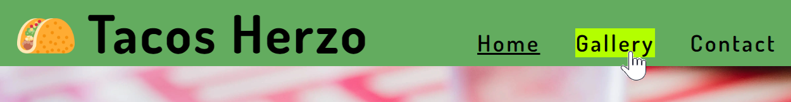

# Tacos Herzo
Tacos Herzo is a website for an imaginary Mexican food restaurant in the heart of Herzogenaurach (Herzo as it's called) in Bayern, Germany. The website is intended for anyone who is interested in trying out Mexican food in Herzo as well for returning customers.

The main purpose of the Tacos Herzo is to increase the number of table reservations for its restaurant.
This is achieved by clearly presenting the dishes and drinks we serve in our Menu which is shown directly in the Homepage. As some people would like to see how our dishes are served, Tacos Herzo also shows pictures of the dishes in a gallery page.

## Features

### Existing Features

- __Navigation Bar__
    - Across the whole website there is a navigation bar on top which includes links to the Logo and Home which will take the user back to index.html, there is also a Gallery and Contact link.
    - This navigation bar will adapt to the screen size to improve the User Experience.
    - The Home, Gallery and Contact links have a green background when the mouse pointer hovers over them, this is to let the user know it is a clickable link.
    - To let the user know in which page they currently are, the link is styled with an underline.

- __Home Page__
    - The user is greeted with a Welcome message on top of a Taco dish hero image, below this welcome message there is a "Book a Table" button.
    - The colors used for Tacos Herzo were inspired by the colors of some of the ingredients used in mexican dishes such as Lime, Avocado, Cilantro as well as Tortillas.
    - Below the hero image, the user finds the menu cards for Tacos, Drinks and Desserts. This straight to the point approach was taken to improve user experience.
    - The menu cards are written both in Spanish and English so there is no confussion.
    - Background music can be played using the audio player near the bottom of the Home Page. By default the music is stopped as it is considered Best Practice.

- __Gallery__
    - On top of the Gallery there is a "Book a table" button so the user can make a reservation.
    - Photos of dishes and drinks served at Tacos Herzo are presented in the Gallery.
    - The Gallery adapts to diferent screen sizes to efficiently use the available screen space.

