# Tacos Herzo - Testing
Testing was done on smartphones running Android and iOS, on a laptop screen as well as a bigger monitor using Chrome, Firefox and Safari.
This testings were of great use to make adjustments to the HTML and CSS code. One example was that the screen of the iPhone 5 was to narrow so the Welcome Message (Bienvenidos) was too wide for it, so the message was adjusted.

On smaller screens the menu cards, gallery photos and goolgle map preview will sort out vertically for a better presentation.

The navigation menu on top of every webpage will also move under the logo and expand horizontally for easier navigation. As seen on the following image:

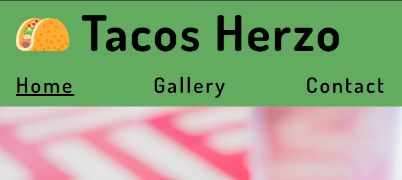

### Validator Testing

- __HTML__
    - The HTML code of all 3 pages was tested using the W3C Markup Validator and no errors were found.

        - Index

            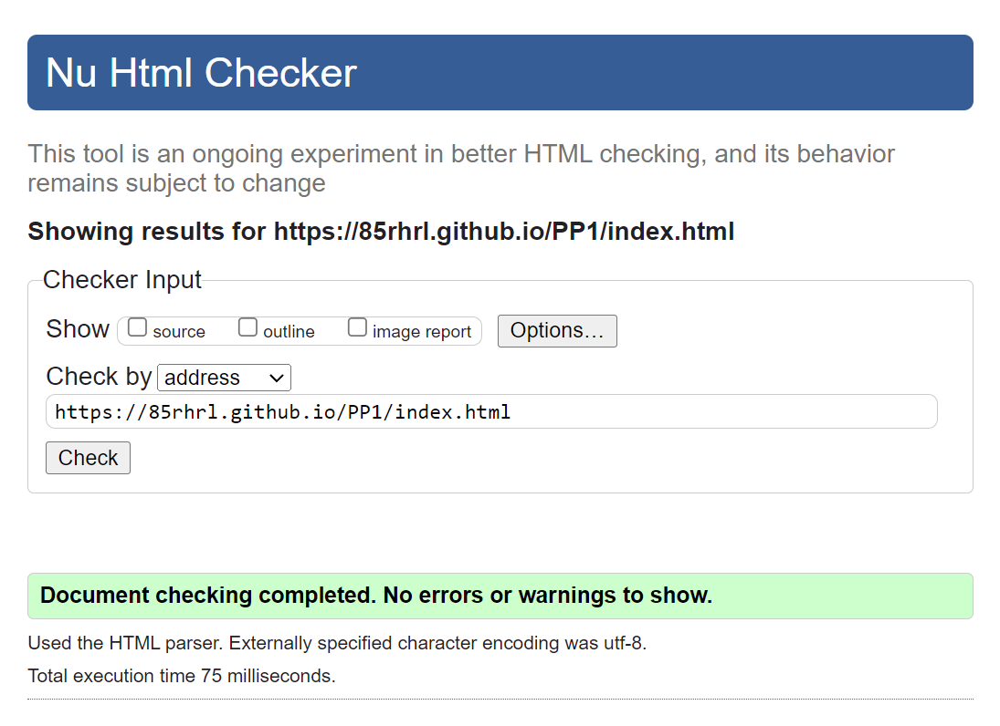

        - Gallery

             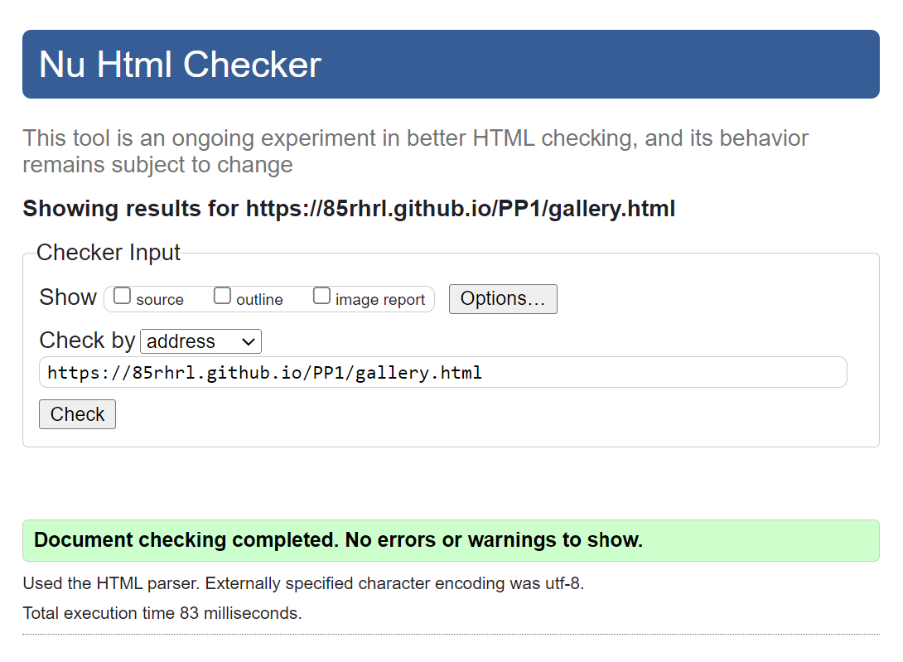

        - Contact
            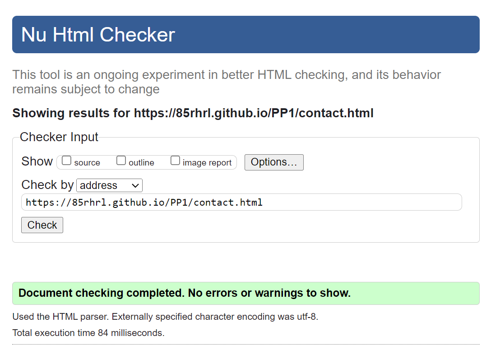

- __CSS__
    - The CSS code was tested using the CSS Validation Service and no errors were found.

        - Style
            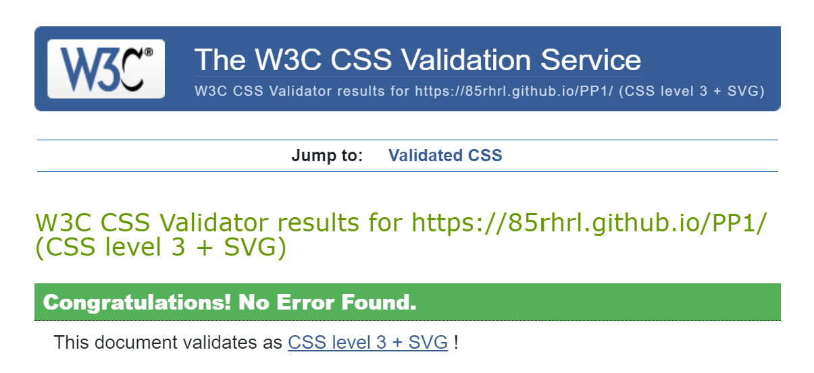

### Lighthouse

Lighthouse is an open-source automated tool to audit a page based on its Performance, Accessibility, Best Practices and Search Engine Optimization (SEO). This audit was performed for every page for Mobile and Desktop. The result were near 100 except for Mobile. The images were taking a bit longer to load so after resizing and compressing them, the score was 81 and 82 for index and gallery respectively.

#### Desktop

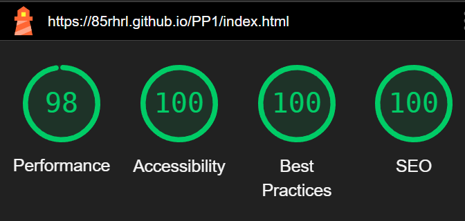
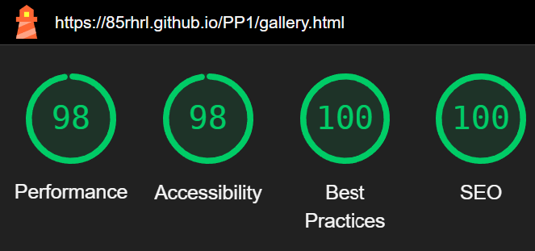
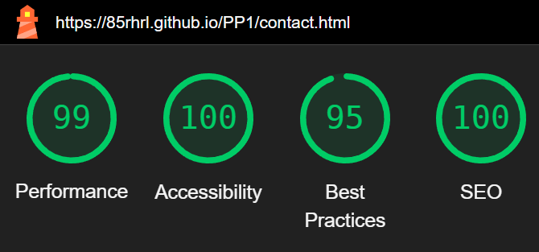

#### Mobile

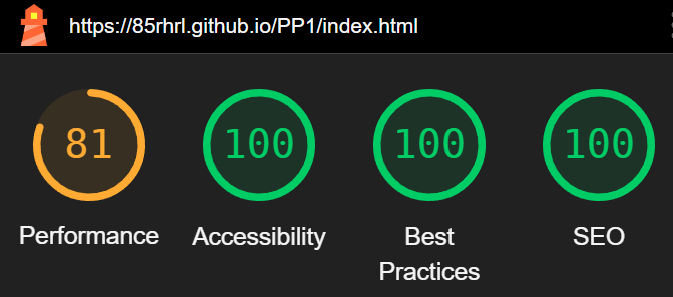
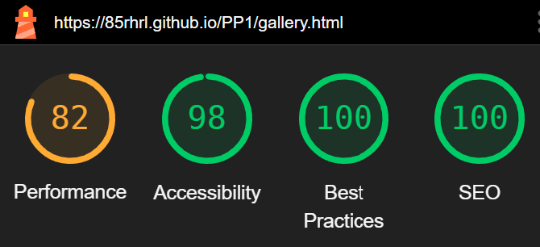
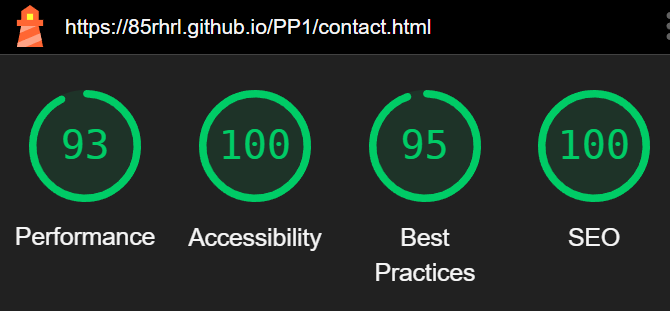