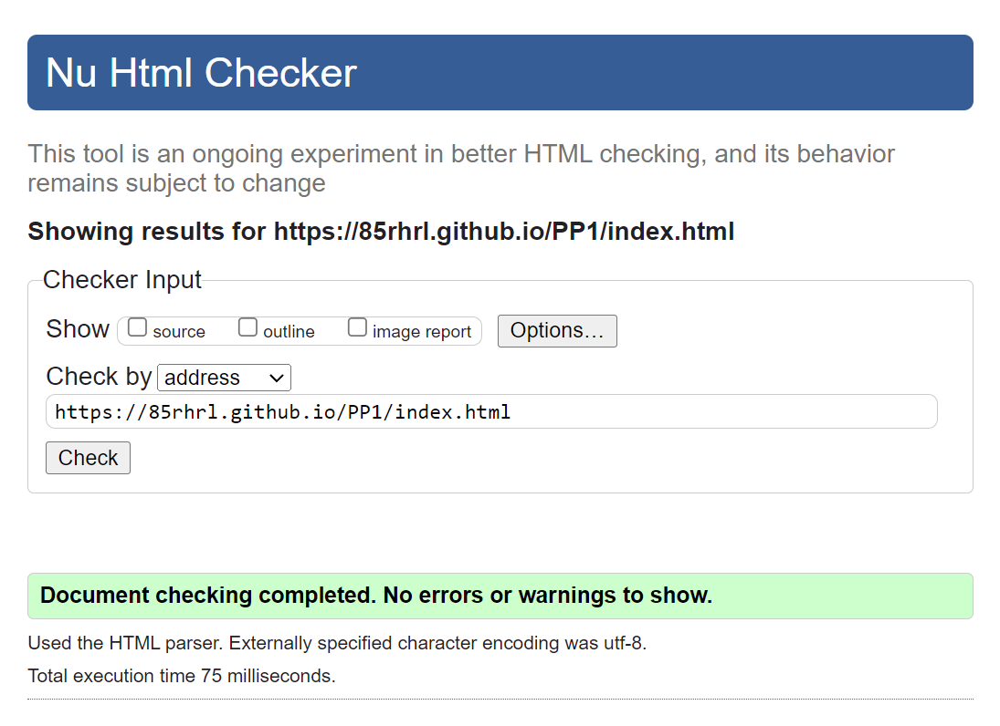
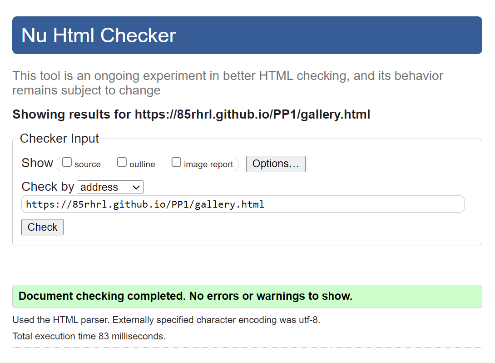
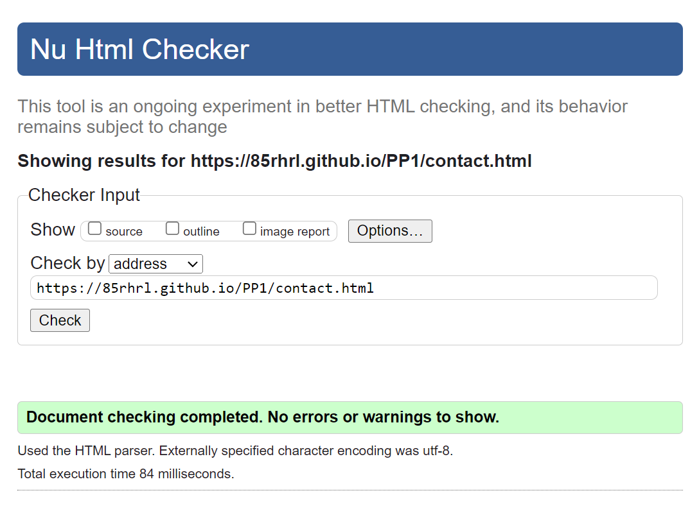
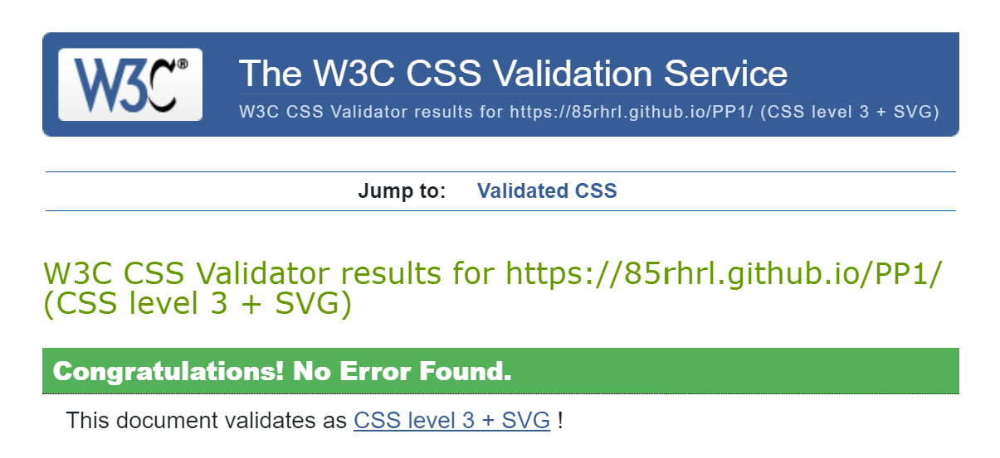

# Tacos Herzo - Testing
Testing was done on smartphones running Android and iOS, on a laptop screen as well as a bigger monitor.
This testing was of great use to make adjustments to the HTML and CSS code.

On smaller screens the menu cards, gallery photos and goolgle map preview will sort out vertically for a better presentation.

The navigation menu on top of every webpage will also move under the logo and expand horizontally for easier navigation. As seen on the following image:

### Validator Testing

- __HTML__
    - The HTML code of all 3 pages was tested using the W3C Markup Validator and no errors were found.

        - Index

            

        - Gallery

             

        - Contact
            

- __CSS__
    - The CSS code was tested using the CSS Validation Service and no errors were found.

        - Style
            

### Lighthouse

To check accesability and performance 